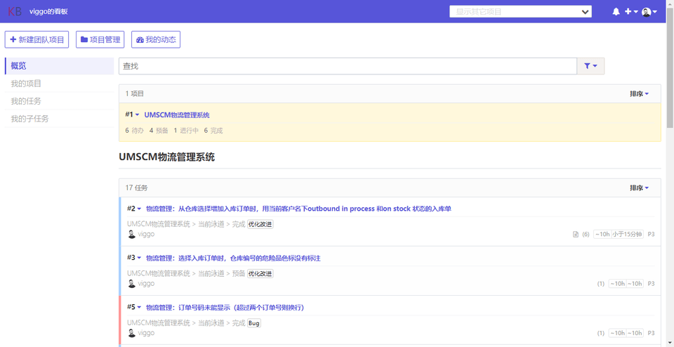
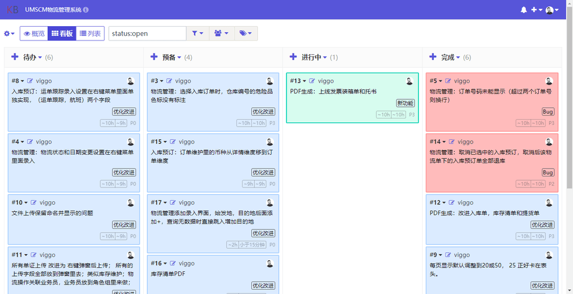
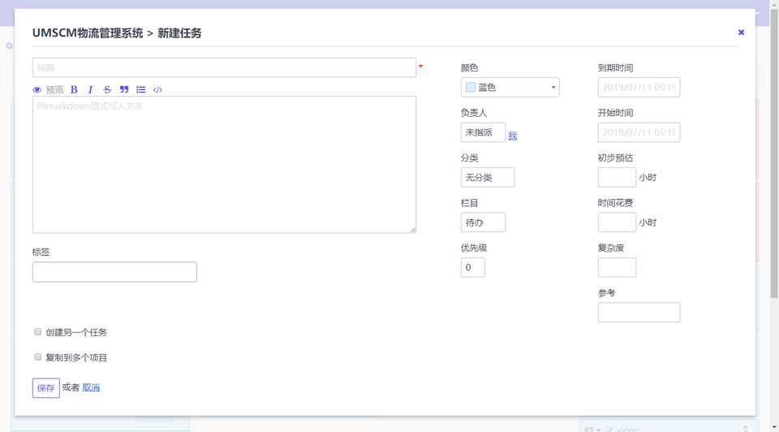
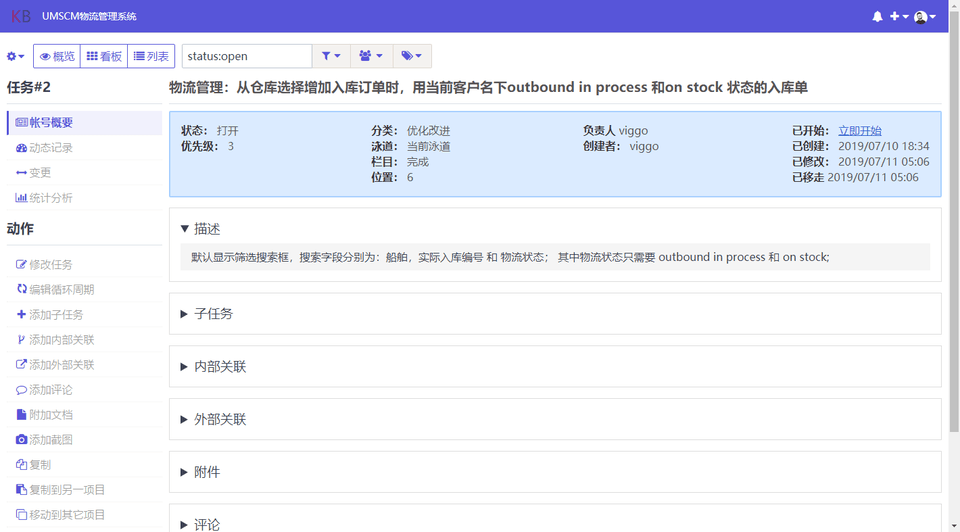

<h1 align="center">Welcome to Kanboard Theme Spectre 👋</h1>
<p align="center">
  
</p>

> This is a modern CSS theme for Kanboard and it's created based on [SPECTRE.CSS](https://picturepan2.github.io/spectre/)

## Screenshot









## Requirements

Kanboard >= v1.2.10  
Kanboard installed at a web server.
You can find the download at [kanboard.org](https://kanboard.org/)

## Installation

You have the choice between 3 methods:

1. Download the zip file and decompress everything under the directory `plugins/Spectre` of your Kanboard installation
2. Clone this repository into the folder `plugins/Spectre` of your Kanboard installation
3. Copy the content of the file `skin.min.css`, paste to the Kanboard `Settings > Application settings Custom Stylesheet`;

Note: Plugin folder is case-sensitive.  
**Important: remove all unused themes**

## Author

👤 **Viggo**

-   Github: [@kuerme](https://github.com/kuerme)

## Show your support

:star: If you like it, do not forget to give a star on GitHub!  
:construction_worker: Any contribution will be highly appreciated

Clone the repository:

```console
git clone https://github.com/kuerme/kanboard-theme-spectre.git
```

## Reporting Issues

Please [create an issue](https://github.com/kuerme/kanboard-theme-spectre/issues) for any bugs you've found.

---

_This README was generated with ❤️ by [readme-md-generator](https://github.com/kefranabg/readme-md-generator)_
